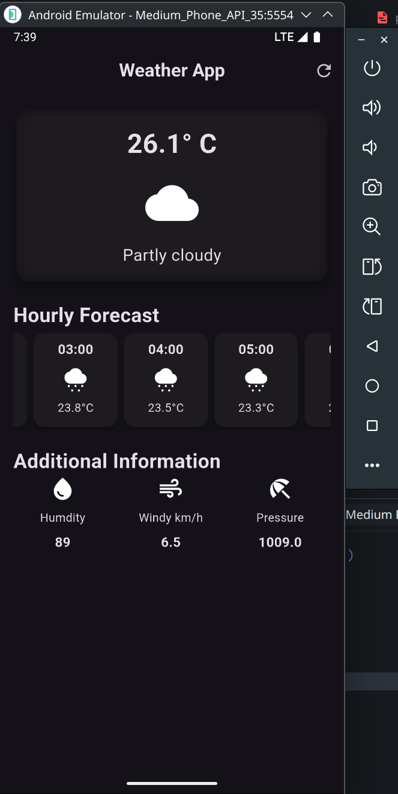

# n05_weather_app

crossAxisAlignment:

# constraints go down
In Flutter, the term "**constraints go down**" refers to how the layout system works in the widget tree, specifically how constraints are passed from parent widgets to their children during the layout process. This is a key concept in understanding Flutter's rendering pipeline. Let me break it down:

## What Are Constraints in Flutter?
Constraints define the rules or boundaries within which a widget must size and position itself. In Flutter, constraints are represented by the `BoxConstraints` class, which includes:
- Minimum width (`minWidth`)
- Maximum width (`maxWidth`)
- Minimum height (`minHeight`)
- Maximum height (`maxHeight`)

These constraints dictate the allowable size range for a widget. For example, a parent widget might tell its child, "You can be between 100 and 200 pixels wide."

## "Constraints Go Down" Explained
In Flutter's layout process:
1. **Parent-to-Child Flow**: The layout process starts at the top of the widget tree (the root widget) and moves downward. Each parent widget passes constraints to its children, telling them the size boundaries they must respect.
2. **Top-Down Propagation**: The parent widget calculates its own constraints (based on its parent's constraints) and then imposes constraints on its children. This is what "constraints go down" means—constraints are passed downward through the widget tree.
3. **Child Response**: Each child widget uses these constraints to determine its own size. After sizing itself, the child reports its final size back up to the parent (this is often referred to as "sizes go up").

## Why Is This Important?
Understanding "constraints go down" helps you:
- Debug layout issues (e.g., overflow errors when a child exceeds constraints).
- Choose the right widgets to achieve your desired layout.
- Optimize performance by ensuring widgets size themselves efficiently within the given constraints.
---

# Sizes Go Up
In Flutter, the phrase "**sizes go up**" refers to the second part of the layout process, where child widgets determine their final size and report it back to their parent widgets after receiving constraints from them (as described in "constraints go down"). This is a core aspect of Flutter's layout system, complementing the top-down constraint propagation. Let’s break it down:

## What Does "Sizes Go Up" Mean?
- After a parent widget passes **constraints** down to its child (via `BoxConstraints`, defining min/max width and height), the child widget:
  1. Uses those constraints to decide its own size (width and height).
  2. Reports this chosen size back up to the parent.

- This upward flow of size information allows the parent to position its children and determine its own size based on the sizes of its children.

## Why It Matters
Understanding "sizes go up" is crucial for:
- **Debugging Layouts**: If a widget is not appearing as expected, check the size it’s reporting to its parent and whether it aligns with the constraints.
- **Responsive Design**: Widgets like `Expanded` or `Flexible` rely on this mechanism to create flexible, responsive layouts.
- **Performance**: Efficiently handling sizes ensures the layout pass is optimized, avoiding unnecessary recalculations.

---

# Parent Sets Position

In Flutter, the phrase "**parent sets position**" refers to how parent widgets determine the position (i.e., the x, y coordinates) of their child widgets within their own layout space during the rendering process. This is the final step in Flutter's layout system, following the "constraints go down, sizes go up" flow. After constraints are passed down from parent to child and the child reports its size back to the parent, the parent decides where to place the child within its boundaries. Let’s dive into the details.

## What Does "Parent Sets Position" Mean?

- Once a child widget has determined its size (based on the constraints provided by the parent), the parent widget is responsible for deciding where that child is placed within its own layout area.
- The position is typically defined as an offset (x, y coordinates) relative to the top-left corner of the parent’s layout space.
- This positioning is handled during the layout phase, specifically in the `performLayout` method of a widget’s `RenderBox` (or equivalent for custom widgets).

## How It Fits into Flutter’s Layout Process
Flutter’s layout system can be summarized in three steps:
1. **Constraints Go Down**: The parent passes BoxConstraints (min/max width and height) to its child.
2. **Sizes Go Up**: The child determines its size within those constraints and reports it back to the parent.
3. **Parent Sets Position**: The parent uses the child’s size and its own layout rules to assign a position (offset) to the child.

The "parent sets position" step happens after the sizes are known, allowing the parent to place the child appropriately based on its layout behavior (e.g., centering, aligning, stacking, etc.).

## Why It Matters
Understanding "parent sets position" helps you:
- **Control Layouts**: Choose the right widget (`Center`, `Align`, `Stack`, etc.) to achieve the desired positioning.
- **Debug Issues**: Fix problems like misaligned widgets or unexpected offsets by tracing constraints, sizes, and positioning logic.
- **Build Custom Layouts**: When creating custom widgets, you can precisely control child positioning by setting their `offset` in `performLayout`.

---

# Widget Tree, Element Tree, and Render Object Tree

In Flutter, the Widget Tree, Element Tree, and Render Object Tree are core concepts that work together to define, manage, and render the user interface of an application. Below is a clear and concise explanation of each, their roles, and how they interact:

### 1. Widget Tree

- **What is it?** The Widget Tree is a hierarchical structure of **widgets** that describes the user interface of a Flutter app. Widgets are immutable configuration objects that define what the UI should look like (e.g., buttons, text, layouts).
- **Role**: Widgets are blueprints or descriptions of the UI. They specify the structure, appearance, and behavior of the app’s interface but don’t directly render anything on the screen.
- Characteristics:
  - Immutable: Widgets are recreated whenever the UI needs to update (e.g., due to state changes).
  - Lightweight: Widgets are cheap to create and dispose of.
  - Hierarchical: Widgets are nested to form a tree, with parent widgets containing child widgets (e.g., a `Column` widget containing `Text` and `Button` widgets).

- **Example**: A `Scaffold` widget might contain an `AppBar` and a `Column`, which in turn contains Text and `ElevatedButton` widgets.
- **Key Point**: The Widget Tree is rebuilt frequently (e.g., on state changes via `setState` or other reactive updates), but Flutter optimizes this process to avoid unnecessary work.

### 2. Element Tree

- **What is it?** The Element Tree is a parallel structure to the Widget Tree, consisting of Element objects. Each Element corresponds to a specific widget instance and <ins>manages its lifecycle and state</ins>.
- **Role**: Elements act as the <ins> "glue" between the Widget Tree and the Render Object Tree.</ins> They hold the mutable state of the UI and manage the connection between immutable widgets and the rendering layer.
- Characteristics:
  - <ins>Mutable</ins>: Unlike widgets, Elements persist across rebuilds and hold references to their corresponding widget and render object (if applicable).
  - <ins>Manages lifecycle</ins>: Elements handle widget updates, state management (e.g., for StatefulWidget), and decide whether to rebuild or reuse render objects.
  - <ins>One-to-one with widgets</ins>: Each widget in the Widget Tree has a corresponding Element in the Element Tree.

- How it works:
  - When the Widget Tree is rebuilt, Flutter compares the new widgets with the existing Element Tree to determine what has changed.
  - If a widget is unchanged (same type and key), the Element updates its reference to the new widget configuration.
  - If a widget changes significantly, the Element may be replaced or updated, potentially affecting the Render Object Tree.

- **Key Point**: The Element Tree ensures efficient UI updates by minimizing changes to the Render Object Tree, which is more expensive to modify.

### Render Object Tree
- **What is it?** The Render Object Tree is a hierarchical structure of **Render Objects**, which are responsible for the actual rendering of the UI (e.g., layout, painting, and hit-testing).
- **Role**: Render Objects handle the low-level mechanics of rendering, such as calculating sizes, positions, and drawing pixels on the screen.
- **Characteristics**:
  - Persistent: Render Objects are more expensive to create and destroy than widgets or elements, so Flutter tries to reuse them across rebuilds.
  - Tied to rendering: Each Render Object corresponds to a visual component (e.g., a `RenderBox` for a box-like widget or a `RenderParagraph` for text).
  - Not all widgets have render objects: Some widgets (e.g., `StatelessWidget` or `StatefulWidget`) are just configuration and don’t directly create render objects. Only leaf nodes like `Text`, `Container`, or `Image` typically map to Render Objects.

- **How it works**:
  - The Element Tree creates and manages Render Objects for widgets that require rendering.
  - Render Objects perform layout calculations (e.g., determining size and position) and painting (drawing to the screen).
  - They also handle user interactions like gestures (hit-testing).

- **Key Point**: The Render Object Tree is optimized to avoid unnecessary updates, as rendering is computationally expensive. The Element Tree decides when to update or recreate Render Objects based on Widget Tree changes

### How They Interact
1. **Widget Tree**:
  - You write Flutter code to create a tree of widgets (e.g., `Scaffold`, `Column`, `Text`).
  - When the UI needs to update (e.g., due to a state change), a new Widget Tree is created.

2. **Element Tree:**
  - Flutter builds an Element Tree to manage the widgets.
  - When the Widget Tree is rebuilt, the Element Tree compares the new widgets to the old ones, updating or reusing Elements as needed.
  - Elements link widgets to their corresponding Render Objects (if any).

3. **Render Object Tree**:
  - Elements create Render Objects for widgets that need to be rendered.
  - The Render Object Tree handles layout, painting, and hit-testing to display the UI on the screen.
  - The Element Tree ensures that only necessary changes propagate to the Render Object Tree, optimizing performance.

 